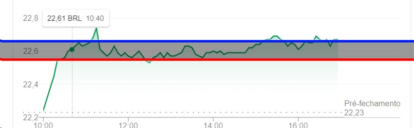

# INOA CHALLENGE

## Desafio
O objetivo do sistema é avisar, via e-mail, caso a cotação de um ativo da B3 caia mais do que certo nível, ou suba acima de outro.

O programa deve ser uma aplicação de console (não há necessidade de interface gráfica).

Ele deve ser chamado via linha de comando com 3 parâmetros.

+ O ativo a ser monitorado
+ O preço de referência para venda
+ O preço de referência para compra

Ex.
> stock-quote-alert.exe PETR4 22.67 22.59

Ele deve ler de um arquivo de configuração com:
+ O e-mail de destino dos alertas
+ As configurações de acesso ao servidor de SMTP que irá enviar o e-mail

A escolha da API de cotação é livre.

O programa deve ficar continuamente monitorando a cotação do ativo enquanto estiver rodando.

Em outras palavras, dada a cotação de PETR4 abaixo.

Toda vez que o preço for maior que linha-azul, um e-mail deve ser disparado aconselhando a venda.

Toda vez que o preço for menor que linha-vermelha, um e-mail deve ser disparado aconselhando a compra.

## Implementação

Para resolver o problema decidi utilizar o padrão de projeto do "Observador". Com esse padrão de projeto, eu consigo isolar e forma fácil a lógica de monitoramento do preço, ou seja, quem decide se o e-mail deve ou não ser enviado, e qual e-mail, da lógica de buscar os preços. Dessa forma eu consigo facilmente modificar a fonte da informação e a maneira que a informação chega na parte principal da solução, sem precisa modificar ela propriamente dita.

Por exemplo, hoje os preços são obtidos fazendo uma requisição para uma API de tempos em tempos, e a cada novo preço, eu "aviso" minha lógica principal que existe um novo preço para ser processado. Dessa forma, eu consigo substituir essa chamada de tempos em tempos para a API, por uma fila de mensageria que a cada vez que o preço muda me disponibiliza essa informação em um tópico, sem a lógica principal ter sequer conhecimento de que algo foi alterado.

Além disso, a adoção deste padrão deixa o código da parte principal mais legível, dado que, devida a natureza do problema, é mais fácil a lógica apenas "reagir" as mudanças.

